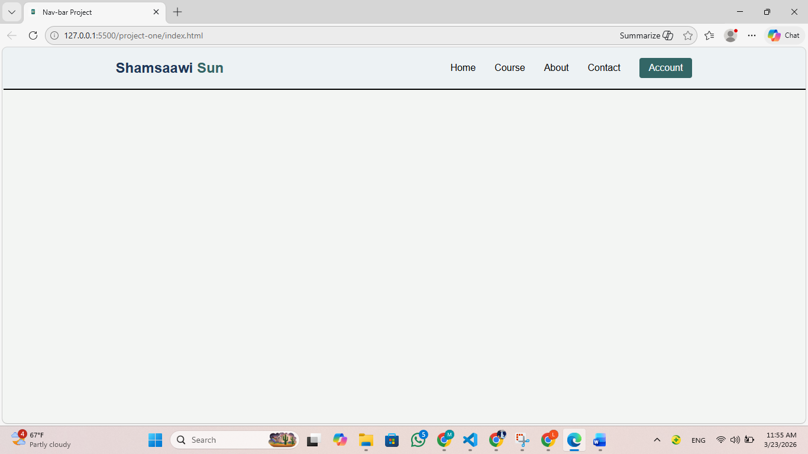

This project is a simple and responsive navigation bar built using HTML, CSS, and JavaScript.

It includes a desktop layout and a mobile-friendly toggle menu.

The goal of this project is to practice:

Flexbox layout
Responsive design with media queries
JavaScript DOM manipulation
Git & GitHub workflow
🚀 Features
✅ Responsive design
✅ Mobile toggle menu
✅ Smooth transition animation
✅ Clean and simple UI
✅ Flexbox layout
🛠 Technologies Used
HTML5
CSS3
JavaScript (Vanilla JS)
Git & GitHub
📂 Project Structure
navbar-project
│── index.html
│── style.css
│── main.js
│── menu.png
📱 How It Works
On desktop screens, navigation links are displayed horizontally.
On screens smaller than 800px:
The menu icon appears.
Navigation links are hidden.
Clicking the menu icon toggles the navigation menu using JavaScript.
⚙ Installation & Usage
Clone the repository:
git clone https://github.com/your-username/navbar-project.git
Open the folder.
Open index.html in your browser.
🌍 Live Demo

You can view the live project here:

https://shamsaawi143.github.io/navbar-project/

(Enable GitHub Pages to make it live.)

📸 Preview
App Screenshot

📚 What I Learned
How to build a responsive navbar
How to use media queries
How to toggle classes using JavaScript
How to push a project to GitHub using terminal
👨‍💻 Author

Created by Mohamed Abdi
